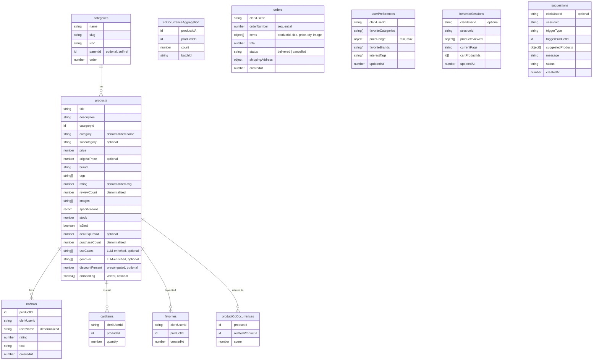
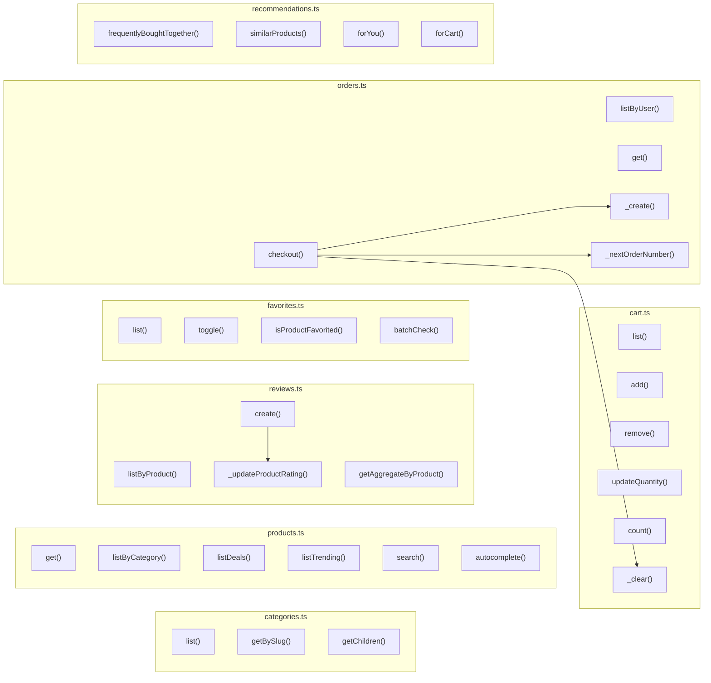
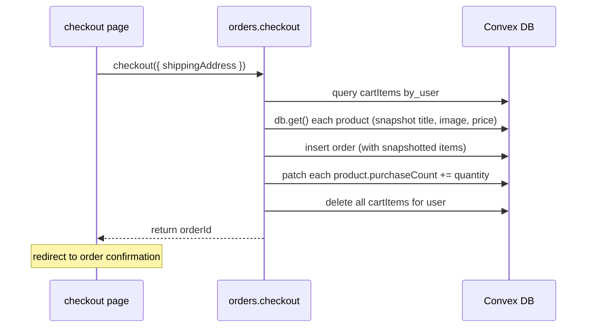
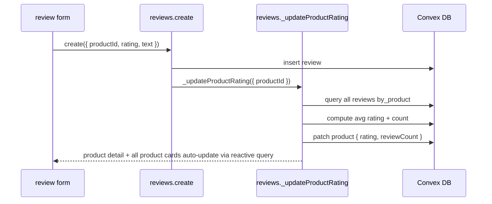

# data layer plan

detailed Convex schema, queries, mutations, and architecture for the zalem store.

---

## design principles

1. **UI drives schema** — every table and index exists to serve a specific page/component from the UI spec
2. **denormalize for reads, normalize for writes** — product cards need zero joins, reviews update a denormalized count on the product
3. **indexes match query patterns** — every `withIndex` call has a corresponding schema index, no `.filter()` scans on large tables
4. **separate cart items** — individual rows per cart item avoid OCC conflicts when two tabs add different products
5. **domain-organized functions** — one file per domain: `products.ts`, `cart.ts`, `favorites.ts`, `orders.ts`, `reviews.ts`, `categories.ts`, `recommendations.ts`
6. **optimistic updates on all user actions** — cart add/remove/quantity, favorite toggle

---

## entity relationship diagram



---

## schema

```typescript
// packages/backend/convex/schema.ts
import { defineSchema, defineTable } from "convex/server";
import { v } from "convex/values";

export default defineSchema({
  // ── categories ──
  // supports: category nav bar, mega menu, browse by category, breadcrumbs
  categories: defineTable({
    name: v.string(),
    slug: v.string(),
    icon: v.optional(v.string()),
    parentId: v.optional(v.id("categories")),
    order: v.number(),
  })
    .index("by_slug", ["slug"])
    .index("by_parent", ["parentId", "order"]),

  // ── products ──
  // the core table. denormalized for zero-join product card rendering.
  // rating + reviewCount updated via mutation when reviews change.
  // purchaseCount updated when orders are placed (for trending/popular sort).
  products: defineTable({
    title: v.string(),
    description: v.string(),
    categoryId: v.id("categories"),
    category: v.string(), // denormalized category name for display + filtering
    subcategory: v.optional(v.string()),
    price: v.number(),
    originalPrice: v.optional(v.number()), // if set, product is discounted
    brand: v.string(),
    tags: v.array(v.string()),
    rating: v.number(), // denormalized average, updated on review add/remove
    reviewCount: v.number(), // denormalized count
    images: v.array(v.string()), // URLs
    specifications: v.optional(
      v.record(v.string(), v.string()), // flexible key-value specs
    ),
    stock: v.number(),
    isDeal: v.boolean(),
    dealExpiresAt: v.optional(v.number()),
    purchaseCount: v.number(), // denormalized, for trending/popular sort
    // ── enrichment fields (inspired by Amazon COSMO knowledge graph, see docs/rufus-research.md) ──
    useCases: v.optional(v.array(v.string())), // e.g., ["gaming", "office", "travel"] — generated via batch LLM during seed
    goodFor: v.optional(v.array(v.string())), // e.g., ["typing comfort", "quiet environments"] — generated via batch LLM during seed
    // ── scale fields (see docs/scale-considerations.md) ──
    discountPercent: v.optional(v.number()), // precomputed: (originalPrice - price) / originalPrice * 100
    embedding: v.optional(v.array(v.float64())), // product embedding for vector similarity search
  })
    // category page: list by category, sort by _creationTime (newest)
    .index("by_category", ["category"])
    // category page: sort by price within category
    .index("by_category_and_price", ["category", "price"])
    // category page: sort by rating within category
    .index("by_category_and_rating", ["category", "rating"])
    // category page: sort by review count within category
    .index("by_category_and_reviewCount", ["category", "reviewCount"])
    // category page: sort by purchase count (popularity) within category
    .index("by_category_and_purchaseCount", ["category", "purchaseCount"])
    // homepage: deals section (isDeal = true, sorted by expiry)
    .index("by_isDeal", ["isDeal", "dealExpiresAt"])
    // homepage: trending (global, sorted by purchase count)
    .index("by_purchaseCount", ["purchaseCount"])
    // filter by brand within category
    .index("by_category_and_brand", ["category", "brand"])
    // category page: sort by discount within category (scale: precomputed field)
    .index("by_category_and_discountPercent", ["category", "discountPercent"])
    // product detail: get by ID is free (ctx.db.get)
    // search: full-text on title, filterable by category
    .searchIndex("search_title", {
      searchField: "title",
      filterFields: ["category"],
    })
    // scale: vector similarity search for "similar products" at 10K+ products
    .vectorIndex("by_embedding", {
      vectorField: "embedding",
      dimensions: 128,
      filterFields: ["category"],
    }),

  // ── reviews ──
  // separate table for independent pagination and writes.
  // on insert/delete: update products.rating and products.reviewCount
  reviews: defineTable({
    productId: v.id("products"),
    clerkUserId: v.string(),
    userName: v.string(), // denormalized for display without user lookup
    rating: v.number(), // 1-5
    text: v.string(),
    createdAt: v.number(),
  })
    // product detail: list reviews for a product, newest first
    .index("by_product", ["productId", "createdAt"])
    // user profile: "my reviews"
    .index("by_user", ["clerkUserId"]),

  // ── cart items ──
  // one row per item. avoids OCC conflicts when adding different products.
  // optimistic updates on add/remove/quantity change.
  cartItems: defineTable({
    clerkUserId: v.string(),
    productId: v.id("products"),
    quantity: v.number(),
  })
    // cart page: list all items for a user
    .index("by_user", ["clerkUserId"])
    // add to cart: check if product already in cart (upsert quantity)
    .index("by_user_and_product", ["clerkUserId", "productId"]),

  // ── favorites ──
  // simple join table. one row per user-product pair.
  favorites: defineTable({
    clerkUserId: v.string(),
    productId: v.id("products"),
    createdAt: v.number(),
  })
    // favorites page: list all favorites for a user
    .index("by_user", ["clerkUserId", "createdAt"])
    // product card: check if product is favorited by user
    .index("by_user_and_product", ["clerkUserId", "productId"]),

  // ── orders ──
  // items are snapshot-embedded (price at purchase time, product title, image).
  // no foreign key dependency — if a product is deleted, order history is intact.
  orders: defineTable({
    clerkUserId: v.string(),
    orderNumber: v.number(), // sequential, human-readable
    items: v.array(
      v.object({
        productId: v.id("products"),
        title: v.string(), // snapshot at purchase time
        image: v.string(), // snapshot
        price: v.number(), // price at purchase time
        quantity: v.number(),
      }),
    ),
    total: v.number(),
    status: v.union(v.literal("delivered"), v.literal("cancelled")),
    shippingAddress: v.object({
      name: v.string(),
      address: v.string(),
      city: v.string(),
      phone: v.string(),
    }),
    createdAt: v.number(),
  })
    // order history: list user's orders, newest first
    .index("by_user", ["clerkUserId", "createdAt"])
    // order history: filter by status
    .index("by_user_and_status", ["clerkUserId", "status", "createdAt"]),

  // ── user preferences ── (phase 3, derived from purchase history)
  userPreferences: defineTable({
    clerkUserId: v.string(),
    favoriteCategories: v.array(v.string()),
    priceRange: v.object({
      min: v.number(),
      max: v.number(),
    }),
    favoriteBrands: v.array(v.string()),
    interestTags: v.array(v.string()),
    updatedAt: v.number(),
  }).index("by_user", ["clerkUserId"]),

  // ── co-occurrences ── (phase 3, precomputed recommendations)
  productCoOccurrences: defineTable({
    productId: v.id("products"),
    relatedProductId: v.id("products"),
    score: v.number(),
  }).index("by_product_and_score", ["productId", "score"]),

  // ── co-occurrence aggregation ── (phase 3, temporary during batch recomputation at scale)
  // used by the batched co-occurrence pipeline when processing 100K+ orders
  // rows are created during batch processing and cleaned up after finalization
  coOccurrenceAggregation: defineTable({
    productIdA: v.id("products"),
    productIdB: v.id("products"),
    count: v.number(),
    batchId: v.string(),
  })
    .index("by_batch", ["batchId"])
    .index("by_product_pair", ["productIdA", "productIdB"]),

  // ── behavior sessions ── (phase 4)
  behaviorSessions: defineTable({
    clerkUserId: v.optional(v.string()),
    sessionId: v.string(),
    productsViewed: v.array(
      v.object({
        productId: v.id("products"),
        dwellTimeMs: v.number(),
        scrollDepth: v.number(),
        cursorHoverMs: v.number(),
        viewedReviews: v.boolean(),
        timestamp: v.number(),
      }),
    ),
    currentPage: v.string(),
    cartProductIds: v.array(v.id("products")),
    updatedAt: v.number(),
  })
    .index("by_session", ["sessionId"])
    .index("by_user", ["clerkUserId"]),

  // ── AI suggestions ── (phase 6)
  suggestions: defineTable({
    clerkUserId: v.optional(v.string()),
    sessionId: v.string(),
    triggerType: v.string(),
    triggerProductId: v.id("products"),
    suggestedProducts: v.array(
      v.object({
        productId: v.id("products"),
        reason: v.string(),
      }),
    ),
    message: v.string(),
    status: v.union(
      v.literal("pending"),
      v.literal("ready"),
      v.literal("shown"),
      v.literal("dismissed"),
      v.literal("clicked"),
    ),
    createdAt: v.number(),
  }).index("by_session_and_status", ["sessionId", "status"]),
});
```

---

## function map

organized by domain. shows which UI component calls each function and the relationships between them.



---

## queries & mutations — detailed

### categories.ts

| function      | type  | args       | used by                           | notes                                                                                        |
| ------------- | ----- | ---------- | --------------------------------- | -------------------------------------------------------------------------------------------- |
| `list`        | query | —          | category nav bar, mega menu       | returns all categories ordered, with parent/child structure. cache-friendly (rarely changes) |
| `getBySlug`   | query | `slug`     | category page breadcrumb, routing | single category by URL slug                                                                  |
| `getChildren` | query | `parentId` | mega menu subcategories           | children of a category, ordered                                                              |

### products.ts

| function         | type  | args                                      | used by                                    | notes                                                                                                                                                            |
| ---------------- | ----- | ----------------------------------------- | ------------------------------------------ | ---------------------------------------------------------------------------------------------------------------------------------------------------------------- |
| `get`            | query | `productId`                               | product detail page                        | single product by ID, `ctx.db.get()`                                                                                                                             |
| `listByCategory` | query | `category, sort, filters, paginationOpts` | category page                              | paginated, uses appropriate index per sort option. filters (price min/max, brands, minRating, inStock) applied via `.filter()` after index narrowing by category |
| `listDeals`      | query | —                                         | homepage deals section                     | `isDeal === true`, sorted by expiry, `.take(6)`                                                                                                                  |
| `listTrending`   | query | `category?`                               | homepage trending, category "popular" sort | by `purchaseCount` desc, `.take(10)`                                                                                                                             |
| `search`         | query | `query, category?, paginationOpts`        | search results page                        | uses `searchIndex("search_title")`, paginated                                                                                                                    |
| `autocomplete`   | query | `query`                                   | search bar dropdown                        | uses search index, `.take(8)`, returns minimal fields (id, title, image, price)                                                                                  |

**sort strategy for `listByCategory`:**

```
sort === "popular"    → .withIndex("by_category_and_purchaseCount").order("desc")
sort === "newest"     → .withIndex("by_category").order("desc")  // _creationTime
sort === "price_asc"  → .withIndex("by_category_and_price").order("asc")
sort === "price_desc" → .withIndex("by_category_and_price").order("desc")
sort === "reviews"    → .withIndex("by_category_and_reviewCount").order("desc")
sort === "discount"   → .withIndex("by_category_and_discountPercent").order("desc")
```

discount % sort uses a precomputed `discountPercent` field on the product document, updated whenever `price` or `originalPrice` changes. this scales to any catalog size — no in-memory sort needed. see `docs/scale-considerations.md` §4.

### reviews.ts

| function                | type              | args                        | used by                         | notes                                                                    |
| ----------------------- | ----------------- | --------------------------- | ------------------------------- | ------------------------------------------------------------------------ |
| `listByProduct`         | query             | `productId, paginationOpts` | product detail reviews tab      | paginated, newest first via `by_product` index                           |
| `getAggregateByProduct` | query             | `productId`                 | product detail rating breakdown | computes 5-star distribution. could be denormalized if perf matters      |
| `create`                | mutation          | `productId, rating, text`   | product detail page             | gets clerkUserId from auth, inserts review, calls `_updateProductRating` |
| `_updateProductRating`  | internal mutation | `productId`                 | called by `create`              | recalculates avg rating + count, patches product                         |

### cart.ts

| function         | type              | args                   | used by                         | notes                                                                                      |
| ---------------- | ----------------- | ---------------------- | ------------------------------- | ------------------------------------------------------------------------------------------ |
| `list`           | query             | —                      | cart page, cart recommendations | gets clerkUserId from auth, joins with product data for display                            |
| `add`            | mutation          | `productId, quantity?` | product card, product detail    | upserts: if product already in cart, increments quantity. uses `by_user_and_product` index |
| `remove`         | mutation          | `productId`            | cart page                       | deletes cartItem row                                                                       |
| `updateQuantity` | mutation          | `productId, quantity`  | cart page quantity stepper      | patches quantity. if quantity <= 0, removes item                                           |
| `count`          | query             | —                      | header cart badge               | returns total item count for user. lightweight query                                       |
| `_clear`         | internal mutation | `clerkUserId`          | called by checkout              | removes all cart items for user                                                            |

### favorites.ts

| function             | type     | args         | used by                       | notes                                                                                |
| -------------------- | -------- | ------------ | ----------------------------- | ------------------------------------------------------------------------------------ |
| `list`               | query    | —            | favorites page                | gets clerkUserId from auth, returns favorites with joined product data, newest first |
| `toggle`             | mutation | `productId`  | product card heart icon       | if exists → delete, if not → insert. idempotent toggle pattern                       |
| `isProductFavorited` | query    | `productId`  | single product card           | boolean check via `by_user_and_product` index                                        |
| `batchCheck`         | query    | `productIds` | product grid (check multiple) | returns `Set<productId>` of favorited products. avoids N+1 queries for product grids |

### orders.ts

| function           | type              | args                      | used by            | notes                                                                                                                              |
| ------------------ | ----------------- | ------------------------- | ------------------ | ---------------------------------------------------------------------------------------------------------------------------------- |
| `listByUser`       | query             | `status?, paginationOpts` | order history page | paginated, filtered by optional status tab. uses `by_user_and_status` or `by_user` index                                           |
| `get`              | query             | `orderId`                 | order detail view  | single order by ID, validates it belongs to the requesting user                                                                    |
| `checkout`         | mutation          | `shippingAddress`         | checkout page      | reads cart items, snapshots product data (title, image, price), creates order, increments `purchaseCount` on products, clears cart |
| `_create`          | internal mutation | `orderData`               | called by checkout | inserts order document                                                                                                             |
| `_nextOrderNumber` | internal mutation | —                         | called by checkout | generates sequential order number                                                                                                  |

### recommendations.ts (phase 3)

| function                   | type  | args        | used by                         | notes                                                                                                                                                                                                                                                                                                                |
| -------------------------- | ----- | ----------- | ------------------------------- | -------------------------------------------------------------------------------------------------------------------------------------------------------------------------------------------------------------------------------------------------------------------------------------------------------------------- |
| `frequentlyBoughtTogether` | query | `productId` | product detail page             | reads `productCoOccurrences` by_product_and_score desc, `.take(4)`, joins product data                                                                                                                                                                                                                               |
| `similarProducts`          | query | `productId` | product detail page             | reads product, finds others in same category with overlapping tags/brand, scores + sorts in memory, `.take(10)`. at scale (~1K+ products per category), switch to reading from a precomputed `productSimilarity` table instead (Convex `vectorSearch()` is action-only, so it cannot back a reactive query directly) |
| `forYou`                   | query | —           | homepage "recommended for you"  | reads `userPreferences`, queries products matching favorite categories/brands/price range, `.take(10)`. falls back to trending for anonymous users                                                                                                                                                                   |
| `forCart`                  | query | —           | cart page "you might also like" | reads cart items, aggregates co-occurrences across all cart products, deduplicates (exclude cart items), top 10                                                                                                                                                                                                      |

---

## data flow diagrams

### checkout flow



### add to cart (with optimistic update)

```mermaid
sequenceDiagram
    participant UI as product card
    participant OPT as optimistic update
    participant M as cart.add
    participant DB as Convex DB

    UI->>OPT: optimistically add item to cart query cache
    UI->>M: add({ productId, quantity: 1 })
    M->>DB: query cartItems by_user_and_product
    alt product already in cart
        M->>DB: patch cartItem (quantity += 1)
    else not in cart
        M->>DB: insert cartItem
    end
    M-->>UI: server confirms (or rollback optimistic)
```

### review creation (denormalization update)



---

## index strategy rationale

every index exists for a specific UI query. no speculative indexes.

| index                                       | serves                                                                                                                                | query pattern                                                                |
| ------------------------------------------- | ------------------------------------------------------------------------------------------------------------------------------------- | ---------------------------------------------------------------------------- |
| `categories.by_slug`                        | URL routing → category page                                                                                                           | `eq("slug", slug)`                                                           |
| `categories.by_parent`                      | mega menu subcategories                                                                                                               | `eq("parentId", id)`, ordered                                                |
| `products.by_category`                      | category page (newest sort)                                                                                                           | `eq("category", cat)`, order desc                                            |
| `products.by_category_and_price`            | category page (price sort)                                                                                                            | `eq("category", cat)`, order asc/desc                                        |
| `products.by_category_and_rating`           | category page (rating sort)                                                                                                           | `eq("category", cat)`, order desc                                            |
| `products.by_category_and_reviewCount`      | category page (review count sort)                                                                                                     | `eq("category", cat)`, order desc                                            |
| `products.by_category_and_purchaseCount`    | category page (popular sort)                                                                                                          | `eq("category", cat)`, order desc                                            |
| `products.by_isDeal`                        | homepage deals                                                                                                                        | `eq("isDeal", true)`                                                         |
| `products.by_purchaseCount`                 | homepage trending                                                                                                                     | global, order desc                                                           |
| `products.by_category_and_brand`            | category filter by brand                                                                                                              | `eq("category", cat).eq("brand", brand)`                                     |
| `products.search_title`                     | search bar + search results                                                                                                           | full-text search                                                             |
| `reviews.by_product`                        | product detail reviews                                                                                                                | `eq("productId", id)`, newest first                                          |
| `reviews.by_user`                           | "my reviews"                                                                                                                          | `eq("clerkUserId", uid)`                                                     |
| `cartItems.by_user`                         | cart page listing                                                                                                                     | `eq("clerkUserId", uid)`                                                     |
| `cartItems.by_user_and_product`             | add-to-cart upsert check                                                                                                              | `eq("clerkUserId", uid).eq("productId", pid)`                                |
| `favorites.by_user`                         | favorites page                                                                                                                        | `eq("clerkUserId", uid)`, newest first                                       |
| `favorites.by_user_and_product`             | favorite toggle + check                                                                                                               | `eq("clerkUserId", uid).eq("productId", pid)`                                |
| `orders.by_user`                            | order history (all)                                                                                                                   | `eq("clerkUserId", uid)`, newest first                                       |
| `orders.by_user_and_status`                 | order history (by tab)                                                                                                                | `eq("clerkUserId", uid).eq("status", s)`                                     |
| `userPreferences.by_user`                   | personalized recommendations                                                                                                          | `eq("clerkUserId", uid)`                                                     |
| `products.by_category_and_discountPercent`  | category page (discount sort)                                                                                                         | `eq("category", cat)`, order desc                                            |
| `products.by_embedding` (vector)            | similar products at scale (action-only — used by batch precomputation action and AI context assembly action, not by reactive queries) | `ctx.vectorSearch("products", "by_embedding", { vector, filter: category })` |
| `productCoOccurrences.by_product_and_score` | frequently bought together                                                                                                            | `eq("productId", pid)`, score desc                                           |
| `coOccurrenceAggregation.by_batch`          | batch cleanup during recomputation                                                                                                    | `eq("batchId", id)`                                                          |
| `coOccurrenceAggregation.by_product_pair`   | accumulate pair counts                                                                                                                | `eq("productIdA", a).eq("productIdB", b)`                                    |

---

## seed script plan

a Convex action (`seed.ts`) that populates the database:

1. **categories** — 8 top-level + 3-4 subcategories each (~30 total)
2. **products** — fetch from DummyJSON API, map fields, assign to categories (~200 products)
3. **reviews** — 2-5 reviews per product using faker.js (~600 reviews), update product denormalized rating/count
4. **orders** — 500 orders across 50 fake users, clustered by persona, spanning 3 months
5. **userPreferences** — derived from generated order history
6. **productCoOccurrences** — computed from order co-purchase patterns

the seed action calls internal mutations in batches to avoid transaction limits.

```
seed.run (action)
  → seed._insertCategories (internal mutation)
  → seed._insertProductsBatch (internal mutation, called N times)
  → seed._enrichProducts (action — batch LLM call to generate useCases + goodFor from title/description/category, uses Flash-Lite)
  → seed._insertReviewsBatch (internal mutation)
  → seed._generateOrders (internal mutation, batched)
  → seed._computeCoOccurrences (internal mutation)
  → seed._deriveUserPreferences (internal mutation)
```

---

## file structure

```
packages/backend/convex/
├── schema.ts                  # full schema definition
├── categories.ts              # category queries
├── products.ts                # product queries (list, search, get)
├── reviews.ts                 # review CRUD + denormalization
├── cart.ts                    # cart mutations + queries
├── favorites.ts               # favorite toggle + queries
├── orders.ts                  # order history + checkout
├── recommendations.ts         # static recommendation algorithms (phase 3)
├── seed.ts                    # seed script action + internal mutations
├── behavior.ts                # behavior tracking (phase 4)
├── ai.ts                      # AI suggestion generation (phase 6)
├── auth.config.ts             # (existing)
├── convex.config.ts           # (existing)
└── _generated/                # (auto-generated, never edit)
```

---

## pagination strategy

pages that need pagination use Convex's cursor-based pagination with `usePaginatedQuery`:

| page             | page size | pattern                                              |
| ---------------- | --------- | ---------------------------------------------------- |
| category listing | 60        | `usePaginatedQuery` with "load more" or page buttons |
| search results   | 60        | same as category                                     |
| order history    | 20        | `usePaginatedQuery`                                  |
| product reviews  | 10        | `usePaginatedQuery` with "load more"                 |

pages that don't need pagination use `.take(N)`:

| page                       | limit | function    |
| -------------------------- | ----- | ----------- |
| homepage deals             | 6     | `.take(6)`  |
| homepage trending          | 10    | `.take(10)` |
| recommended for you        | 10    | `.take(10)` |
| frequently bought together | 4     | `.take(4)`  |
| similar products           | 10    | `.take(10)` |
| cart recommendations       | 10    | `.take(10)` |
| autocomplete               | 8     | `.take(8)`  |

---

## auth & session model

### what requires authentication

all user-specific writes extract `clerkUserId` from the auth context:

```typescript
const identity = await ctx.auth.getUserIdentity();
if (!identity) throw new ConvexError("not authenticated");
const clerkUserId = identity.subject; // Clerk user ID
```

| feature                             | anonymous                   | authenticated      |
| ----------------------------------- | --------------------------- | ------------------ |
| browse products, categories, search | yes                         | yes                |
| product detail + reviews            | yes (read)                  | yes (read + write) |
| cart (add, remove, quantity)        | **no** — prompt to sign in  | yes                |
| favorites                           | **no** — prompt to sign in  | yes                |
| checkout + orders                   | **no**                      | yes                |
| behavior tracking                   | yes (session-scoped)        | yes (user-scoped)  |
| AI advisor (readiness signals)      | yes (client-side only)      | yes                |
| AI advisor (LLM calls)              | **no** — prompt to sign in  | yes                |
| personalized recommendations        | no (falls back to trending) | yes                |

### why cart requires auth

the simplest correct approach for this project. anonymous carts add complexity (session-to-user merge, session expiry, storage of orphaned sessions) without meaningful benefit for a demo store. the UX tradeoff: when an anonymous user clicks "add to cart," they see a sign-in prompt. this is standard for many stores (Clerk's sign-in modal makes it low-friction).

### behavior tracking for anonymous users

`behaviorSessions` supports anonymous users via the `sessionId` field (a client-generated UUID stored in localStorage). anonymous behavior data is:

- used client-side for readiness signals (question chips, advisor button pulse)
- flushed to the backend with `clerkUserId: undefined`
- **not** merged with an authenticated profile if the user later signs in (intentional privacy-by-design)
- cleaned up after 24 hours via cron to avoid orphaned data

### recently viewed (anonymous-friendly)

the "recently viewed" section on the home page uses client-side localStorage, not the backend. this works for both anonymous and authenticated users with zero backend cost.
